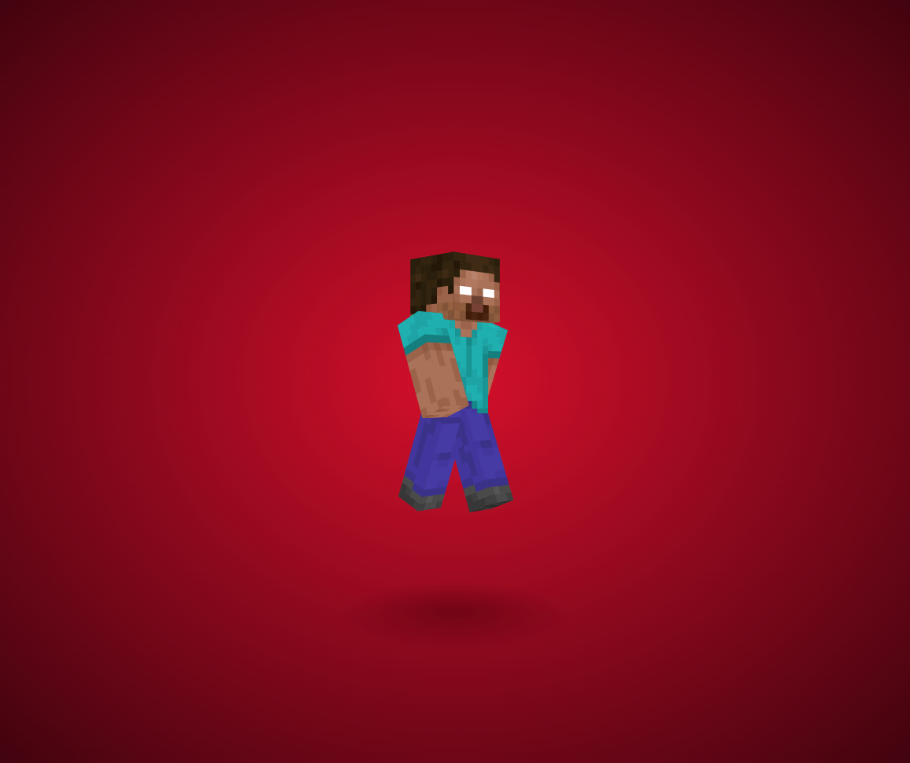

# 3D 行走木头人背景

纯 CSS 3D 构建的 Minecraft 风格角色展示页面，支持鼠标/触控拖拽旋转和行走动画。



## 功能

- **纯 CSS 3D** — 每个身体部位由 6 个面拼成立方体，通过 `rotateX/Y` + `translateZ` 定位
- **行走动画** — 四肢循环摆动，头部轻微晃动，使用 CSS `@keyframes`
- **交互旋转** — 拖拽/滑动可任意角度旋转观看，使用 Hammer.js + GSAP
- **可换皮肤** — 支持替换为标准 Minecraft 皮肤

## 使用方法

直接用浏览器打开 `index.html` 即可。

## 换皮肤

把标准 Minecraft 皮肤（64×64 PNG）放到 `img/` 目录下，然后在项目根目录运行：

```bash
node img/convert-skin.js img/你的皮肤.png img/godofredoninja.png
```

脚本会自动将 64×64 皮肤映射为项目所需的 640×320 精灵图。

## 技术栈

- CSS 3D Transforms (`preserve-3d`, `perspective`)
- CSS `@keyframes` 动画
- jQuery
- GSAP (TweenMax) — 平滑旋转动画
- Hammer.js — 手势识别
- Sharp — 图片处理

## 文件结构

```
./
├── index.html          # 主页面
├── css/
│   └── style.css       # 3D 样式与动画
├── js/
│   ├── index.js        # 交互旋转逻辑
│   ├── jquery.min.js
│   ├── TweenMax.min.js
│   └── hammer.min.js
├── img/
│   ├── godofredoninja.png  # 角色皮肤贴图 (640×320)
│   ├── convert-skin.js     # 64×64 → 640×320 转换脚本
│   ├── 皮肤替换方法.txt
│   └── index.html.png      # 截图
└── README.md
```

## 参考

原项目灵感来自 [GodoFredo](https://codepen.io/godofredo) 的 CSS 3D Minecraft 角色。
